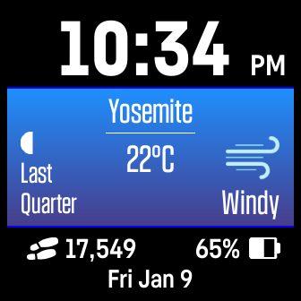

# Weather Watch
A weather themed Fitbit watch-face. The display includes current location, local temperature, weather condition, and lunar phase. Additionally daily steps, battery percentage, and date are displayed at bottom of screen. 

Color of top and bottom of screen items can are controlled with watch settings in the Fitbit phone app. 

The following permissions are required: access location, run background, access activity.

Note: This clockface is not yet published to the Fitbit app store.

[Fitbit App Gallery listing](https://gallery.fitbit.com/details/148eccb6-f062-4f8d-86a4-14e6cac0ab6a?key=e06f855f-a29b-4b04-84cb-2dfe798a66a3) 

General Troubleshooting: 
- If the settings values in the Fitbit phone app become out of sync with the actual display of the watchface, try toggeling the out of sync values on the phone a couple times to resolve the issue.

Troubleshooting: If the temperature does not show up: 
- Ensure that watch-face permissions are enabled. 
- Ensure that Fitbit app permissions on phone, including location services and background refresh, are enabled. 
- Try toggling on and off location services and background refresh permissions for Fitbit app on your phone. 
- Try reinstalling watch-face. 
- Try turning on and off on your phone. 
- Perform synching after above steps.

Troubleshooting: Switching between Celsius and Fahrenheit:
1. In Fitbit phone app, on "Today" screen, click on profile picture -> Fitbit settings -> Date, Time & units -> UNITS OF MEASUREMENT.
2. An option to switch between Celsius and Fahrenheit is available across from Temperature. However, it may be necessary to toggle the Length value between "Feet, Miles" and "Centimeters, Kilometers" to actually toggle between Fahrenheit and Celsius in the Night Shift watch face. This seems to be an issue with the Fitbit software. 
